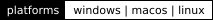
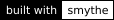
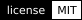

<div align="center">
  
  <p><em>An animated glyph-rain screensaver and WebGL explorer, built as a demonstration of Smythe's agent swarm orchestration.</em></p>
  <p>
    <a href="https://github.com/petehottelet/noumenon/actions/workflows/ci.yml?query=branch%3Amain+event%3Apush"></a>
    <a href="https://noumenon-six.vercel.app/svg-preview/"></a>
    
    <a href="https://github.com/petehottelet/smythe"></a>
    <a href="LICENSE"></a>
  </p>
  <p>
    <a href="https://noumenon-six.vercel.app/svg-preview/">Live explorer</a> ·
    <a href="#how-it-works">How it works</a> ·
    <a href="#run-the-web-views">Run the web views</a> ·
    <a href="#build-the-native-ports">Build the native ports</a>
  </p>
</div>

Noumenon is an animated screensaver and web explorer that is a demonstration project for 
[Smythe](https://github.com/petehottelet/smythe)'s agent swarm orchestration. The benchmark generates runs of **192 and 256 original SVG glyphs**.
The web explorer runs in any WebGL browser, distributed as source only.

<p align="center">
  
</p>

The animation shows the Classic explorer with the original-glyph mix at 100%.
[Still image](svg-preview/preview.png) · [Capture record](svg-preview/preview-animation.json) ·
[All 192 glyphs](catalog/contact-sheet-128.png).

Noumenon is Smythe's agent swarm orchestration and parallel-processing showcase. Smythe's
[Noumenon benchmark](https://github.com/petehottelet/smythe/blob/main/benchmarks/noumenon_benchmark.md)
runs glyph generation as one 192-node fan-out graph, one node per glyph, and
executes the nodes concurrently. The 192 SVG glyphs rendered here come from
Smythe's contour catalog, which its
[SVG workflow benchmark](https://github.com/petehottelet/smythe/blob/main/benchmarks/svg_v2_results.md)
compiles, validates and exports. This repository vendors that catalog and
renders it; it does not import Smythe's Python packages.

- [How it works](#how-it-works)
- [Run the web views](#run-the-web-views)
- [Build the native ports](#build-the-native-ports)
- [Native checks](#native-checks)
- [Glyph catalog](#glyph-catalog)
- [Regenerate derived data](#regenerate-derived-data)
- [Tests and CI](#tests-and-ci)
- [Deploy the web views](#deploy-the-web-views)
- [Credits and licenses](#credits-and-licenses)

## How it works

The explorer and the native ports can generate an infinite amount of new glyphs dynamically when run using the smythe framework. Alternatively, they can draw from a catalog of 248 precreated glyphs. The native savers use their layered motion and host controls. The web explorer supplies the REGL exposure pipeline, 3D navigation, and live settings; those behaviors are next for native exploration modes.

## Run the web views

| View | Source | Run it |
|---|---|---|
| Reference-based web explorer | [svg-preview/](svg-preview/README.md) | serve the repository locally, then open `/svg-preview/` |
| 192-glyph gallery | [svg-preview/catalog.html](svg-preview/catalog.html) | serve the repository locally, then open `/svg-preview/catalog.html` |
| Layered Canvas view | [index.html](index.html) + [glyphs.js](glyphs.js) | open `index.html` directly, or serve the repository and open `/` |

From the repository root:

```bash
python -m http.server 8000 --bind 127.0.0.1
```

Then open <http://localhost:8000/svg-preview/>. The explorer needs a
WebGL-capable browser and no API key or build step.

**Explorer.** Classic uses the reference's fixed 2D grid. The 3D look adds
arrow-key travel, in the 3D and Warp speed presets; Operator is a separate
visual look. Presets such as Downpour, Inferno, Synthwave, Northern lights,
Hunter, Runestones, Arcade, and Warp speed build on those three looks, and the
glyph face swaps the Smythe glyphs for Yautja, Ogham, Runic, Tifinagh,
Braille, or terminal and 8-bit type. Settings open in a floating phosphor control panel along
the bottom of the window: click or tap the bottom-right corner, or press S.
For a few seconds after the page loads, a tooltip points out the corner and
the gear shows beside it; the two fade out together. Afterwards the gear
fades in only while a mouse hovers the corner. Escape or a click on the rain
closes the panel. Changes apply live, and the URL retains the configuration.
Space pauses playback, R resets the viewpoint, and F toggles fullscreen. The
panel is a folder whose raised tab, flush left with a 60° slope, carries the
outlined Trajan Bold SMYTHE wordmark; it sets Roboto and IBM Plex Mono in green `#37FF6E` and bright
`#9CFFBC` with a soft glow and scanlines, and its menus open in the same
style. With any other body palette, the panel, tooltip, gear, and wordmark
take their colors from it. The rain's default grade is 137° Matrix green with mint `#A2FFD8`
highlights; Reference colors and 11 other palettes remain selectable. The
[explorer guide](svg-preview/README.md) covers settings, the renderer, and its
checks.

**Layered Canvas view.** Click or press F to toggle fullscreen and Space to
pause. The cursor and badge hide when idle, and `prefers-reduced-motion`
renders a static frame instead of animating. This view draws only the 192
originals; [noumenon-preview.png](noumenon-preview.png) shows it.

## Build the native ports

Noumenon publishes no precompiled binaries. Build a port locally from the
repository root; the build scripts create `dist/` and write their outputs
there, and Git ignores it. Receipts for the withdrawn 1.1 native packages
(checksums, build provenance, and verification records) remain in the
repository history, and `git log --stat -- dist` lists them. They describe
those earlier packages, not a new local build.

| Port | Source | Build | Output |
|---|---|---|---|
| Windows 11 (`.scr`) | [windows/](windows/) | `windows\build_windows.cmd` | `dist\Noumenon.scr` |
| macOS 12+ (`.saver`) | [macos/](macos/) | `bash macos/build_macos.sh` | `dist/Noumenon.saver` |
| Linux / X11 | [linux/](linux/README.md) | `sh linux/build_linux.sh` | `dist/noumenon-linux-<arch>` |

### Windows

Build with the C# compiler bundled with Windows (.NET Framework); no SDK,
NuGet, or network access is needed:

```bat
windows\build_windows.cmd
```

The output is `dist\Noumenon.scr`, with the reference MIT notice beside it as
`Noumenon-NOTICES.txt`. Right-click your local build and choose **Install** to
open Screen Saver Settings. Keep the file in its chosen location: moving or
deleting it invalidates the registered path. Copying it into an arbitrary
folder alone does not register it. Arguments are `/s` for fullscreen,
`/p <hwnd>` for the settings preview, `/c` for the about box, and `/w` for a
resizable preview window.

### macOS

Install the Xcode command-line tools, then build the universal bundle:

```sh
bash macos/build_macos.sh
```

The output is `dist/Noumenon.saver`, containing arm64 and x86_64 slices, and
`dist/Noumenon-macos-universal.zip`. Double-click your local bundle to install
it. The build applies an ad-hoc signature; Developer ID signing and
notarization remain planned.

### Linux

Install the [X11 and Cairo build dependencies](linux/README.md), then build:

```sh
sh linux/build_linux.sh
dist/noumenon-linux-x86_64 --window
```

The default output name follows the host architecture. Configure your local
executable in XScreenSaver if desired. Native Wayland screensaver and
lock-screen integration remain planned.

## Native checks

Each port has a smoke check that CI runs against a fresh build:

- **Windows** — `windows/smoke_windows.ps1` loads the compiled `.scr`, checks
  rendering, motion, and resize, and launches its `/p` preview process inside
  a hidden host window through clean exit.
- **macOS** — `bash macos/smoke_macos.sh` loads the universal bundle and checks
  preview/fullscreen rendering, motion, resize, and stop behavior. CI runs it
  on Apple Silicon and again on Intel with the same bundle.
- **Linux** — the [smoke harness](linux/README.md) checks the ELF under Xvfb,
  including visible frames, animation, embedding, resizing, invalid input, and
  shutdown. CI builds on Ubuntu 22.04 and repeats the check on 24.04.

Each check also renders the complete native glyph atlas, verifies the blank
slot and filled counters, and records the catalog hashes and mixed selection.
Local builds need their own verification. `verification/analyze_native_masks.py`
compares a native 64 px atlas with an independent source-SVG rendering as a
diagnostic, not an acceptance gate. These checks validate native execution; OS
installation policy and session locking remain separate concerns. Windows `/s`
multi-monitor dispatch is not covered.

## Glyph catalog

The originals in [catalog/](catalog/README.md) are a vendored copy of
Smythe's canonical catalog. Source: Smythe `benchmarks/noumenon/catalog`.
`catalog.json`, `manifest.json`, and `GLYPH-000.svg` through `GLYPH-191.svg`
are byte-identical to it, pinned by the SHA-256 of `manifest.json`:

```text
a4d29072ab56d49fb05eca150ee510f823e727e59f9b861d76a28a92e7c34168
```

The manifest lists every SVG's SHA-256. The test suite checks the pin, each
SVG, and every export derived from the catalog. The outlines use broad
strokes, straight terminal cuts, controlled curves, and deliberate gaps.
Per-glyph speeds and trail lengths come from
[glyph-motion.json](glyph-motion.json), taken from the glyph specifications
of the same Smythe fan-out graph. Smythe keeps the generator, the authored
contours, and the catalog's review and measurement records;
[catalog/README.md](catalog/README.md) describes how to update the copy.

[Complete 192-glyph contact sheet](catalog/contact-sheet-128.png) ·
[16 px](catalog/contact-sheet-16.png) · [32 px](catalog/contact-sheet-32.png) ·
[64 px](catalog/contact-sheet-64.png) · [Individual SVGs and hashes](catalog/manifest.json).

## Regenerate derived data

```bash
python export_glyphs.py
python export_native_glyphs.py
python export_native_glyphs.py --check
python export_generated_sdf.py --check
python export_face_sdf.py --check
python export_face_sdf.py --fonts FONT_DIR
python import_reference_glyphs.py --check
```

- `export_glyphs.py` writes `glyphs.js` for the layered Canvas view and
  `svg-preview/glyphs.js` for the explorer.
- `export_native_glyphs.py` writes `windows/GlyphData.cs`, `macos/glyphs.json`,
  `linux/glyph_data.h`, and `native-catalog.json` from the current SVGs;
  `--check` compares them without writing. It reads published artwork and
  preserves the licensed reference outlines; it does not run a generator.
- `export_generated_sdf.py --check` binds the explorer's MSDF atlas to every
  source SVG. Rebuilding the atlas needs MSDFgen 1.13 (`--msdfgen PATH`).
- `export_face_sdf.py --fonts FONT_DIR` builds every glyph face's
  distance-field atlas: Yautja from its vendored polygon source, and the
  Google Fonts faces from the pinned font files, which are build inputs and
  not part of the repository. `--check` verifies each atlas against its
  receipt and rebuilds every face whose source is present.
- `import_reference_glyphs.py --check` reproduces the reference artwork files
  offline from the pinned source atlas.

## Tests and CI

The offline suite needs Python 3.10 or later and Node.js 22:

```bash
python -m pip install -r requirements-dev.txt
python -m pytest tests -q
node svg-preview/verify-settings.mjs
```

The tests make no network or API calls. Checks that need a native toolchain
skip when it is absent: the Windows renderer checks use the C# compiler
bundled with Windows, and the Linux executable check needs a C compiler,
X11/Cairo development packages, librsvg, and Xvfb. The suite also fails any
import of Smythe's packages, so it runs the same with or without Smythe
installed.

[CI](.github/workflows/ci.yml) runs the Python tests on Ubuntu and Windows,
the explorer's `verify-*.mjs` checks, and the native export check. It then
builds each port and runs its smoke check on Windows, macOS (Apple Silicon
and Intel), and Linux (Ubuntu 22.04 and 24.04). Build outputs are kept as
workflow artifacts for inspection, not published as releases.

## Deploy the web views

The repository root is a self-contained static site ([vercel.json](vercel.json),
[.vercelignore](.vercelignore)):

```bash
vercel deploy --prod
```

`/` serves the layered Canvas view and `/svg-preview/` serves the explorer;
`/svg-preview` redirects to `/svg-preview/` so the explorer's relative
stylesheets and scripts resolve. Every page gets a Content Security Policy
that allows only same-origin scripts, styles, fonts and images. Under
`/svg-preview/`, the policy also allows `'unsafe-eval'`, because REGL
compiles its draw commands at runtime, and Google Fonts stylesheets and font
files for the interface's Roboto and IBM Plex Mono; the rest of the site
allows neither.

The [noumenon.cc](https://noumenon.cc) domain forwards to this repository
through a separate Vercel project, `noumenon-redirect`;
[infrastructure/redirect](infrastructure/redirect/README.md) holds its
configuration and deploy steps.

## Credits and licenses

Noumenon is released under the [MIT License](LICENSE). The 192 original
glyphs come from [Smythe](https://github.com/petehottelet/smythe), and the
Yautja face's 52 glyphs from [Yautja](https://github.com/petehottelet/yautja),
both under the same license and copyright. The Ogham, Runic, Tifinagh,
Braille, Share Tech Mono, and Press Start 2P faces are distance fields
rendered from SIL Open Font License fonts; the fonts themselves are not
redistributed.

The web explorer adapts the renderer and classic artwork from
[m8e/matrix-rain](https://github.com/m8e/matrix-rain), a fork of
[Rezmason/matrix](https://github.com/Rezmason/matrix). Credit to Rezmason and
the project's contributors for the reference implementation of glyph
presentation, traveling illumination, green palettes, bloom, and depth.

The imported source is pinned to [revision 5ba9049](https://github.com/m8e/matrix-rain/tree/5ba90490453ceceb6812d6b1bc658a99a92411d0).
Its [MIT license](https://github.com/m8e/matrix-rain/blob/5ba90490453ceceb6812d6b1bc658a99a92411d0/LICENSE)
credits **Copyright (c) 2018 Rezmason**. Copies of the notice accompany the
[engine](svg-preview/engine/LICENSE) and [base artwork](svg-preview/reference/LICENSE).
Native builds include the reference MIT notice: Windows and Linux embed it in
the executable, and the macOS bundle includes it in its resources. The
[artwork provenance](svg-preview/reference/provenance.json) identifies the
source atlas and extracted outlines, and records the reference project's
account of the artwork's earlier origins. The REGL rain, bloom, and palette
passes are adapted licensed code; the 192 Smythe glyphs are independently
authored. [Third-party notices](svg-preview/THIRD_PARTY_NOTICES.md) also cover
REGL, gl-matrix, the interface fonts and settings icon, and the MSDFgen-built
atlas.
