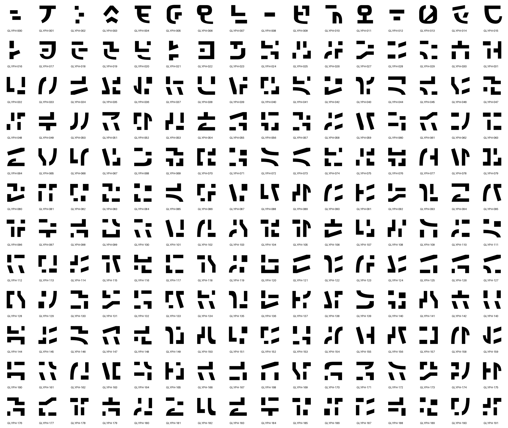

# Original glyph catalog

**192 original SVG glyphs** generated by
[Smythe](https://github.com/petehottelet/smythe). This directory is a vendored
copy of Smythe's canonical catalog in `benchmarks/noumenon/catalog`:
`catalog.json`, `manifest.json`, and `GLYPH-000.svg` through `GLYPH-191.svg`
are byte-identical to that source. The 16, 32, 64, and 128 px contact sheets
come from the same catalog.



[Full-resolution sheet](contact-sheet-128.png) · [16 px](contact-sheet-16.png) ·
[32 px](contact-sheet-32.png) · [64 px](contact-sheet-64.png) ·
[Individual SVGs and hashes](manifest.json). Small-size sheets enlarge the
native raster with nearest-neighbor sampling.

## Pin

The catalog is pinned by the SHA-256 of `manifest.json`:

```text
a4d29072ab56d49fb05eca150ee510f823e727e59f9b861d76a28a92e7c34168
```

The manifest records every SVG's SHA-256; `catalog.json` carries the same
paths and hashes plus its own `catalog_sha256`. The test suite checks the pin,
every SVG hash, and that the web and native exports use exactly these paths.

## Updating

1. Copy `catalog.json`, `manifest.json`, the `GLYPH-*.svg` files, and any
   changed contact sheets from Smythe's `benchmarks/noumenon/catalog`.
2. Record the new `manifest.json` SHA-256 here, in the top-level README, and
   in `tests/test_catalog.py`.
3. Regenerate the derived data with `python export_glyphs.py` and
   `python export_native_glyphs.py`, then rebuild the explorer's MSDF atlas
   with `python export_generated_sdf.py --msdfgen PATH_TO_MSDFGEN` (MSDFgen 1.13).
4. Run the test suite.

The generator and its authored contours stay in Smythe. Noumenon reads the
published artwork only. Per-glyph speeds and trail lengths for the web and
native motion come from [glyph-motion.json](../glyph-motion.json), also taken
from Smythe.
